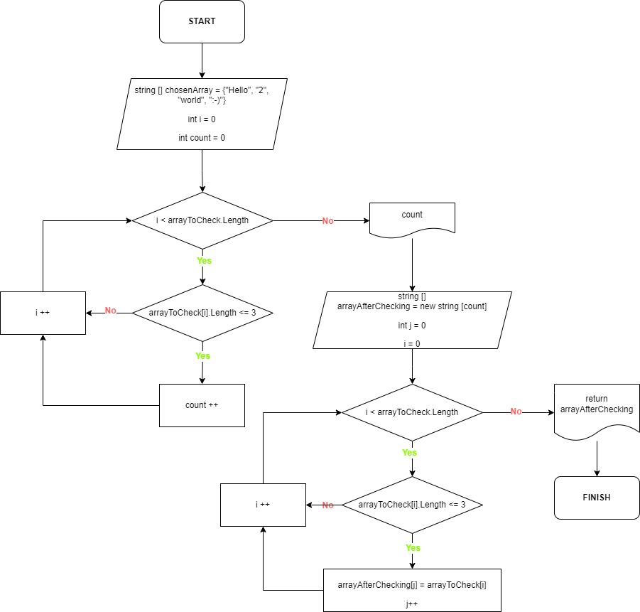

# **_Итоговая контрольная работа по основному блоку GeekBrains_**
## **Автор:** Николай Гаврилов
---

### Используемые методы:

Каждая весомая операция в ходе выполнения задачи обрабатывается в собственном методе. 
Всего в моём решении представлено 4 метода:

* **ChooseYourExample** - метод, предлагающий испытать решение задачи на трех предложенных в условии примерах. Предполагается, что пользователь выберет один из трех вариантов или выберет четвертую опцию: задаст свой пример.

* **InputYourExample** - метод для введения пользователем своего примера. Сперва пользователь выбирает длину своего массива, а затем поочередно вводит элементы массива.

* **PrintArray** - метод печати массива. Используется как в начале прохождения задачи для вывода изначально выбранного или заданного пользователем массива, так и в конце - для вывода полученного результата. В команде вывода строки добавлены условия и дополнительные знаки для примерного стилистического соответствия образцу, предложенному в условиях задачи.

* **ArrayAfterCheck** - метод проверки длины элементов выбранного или заданного пользователем массива. Первый цикл выявляет количество элементов, соответствующих условиям задачи. Таким образом, результат счетчика становится длиной нового массива. Производится повторная проверка на соответствие условию *(меньше или равно 3)*, после чего прошедшие проверку элементы заносятся в новый массив.

---

### Блок-схема основного метода в моём решении (ArrayAfterCheck)

---

### Описание последовательности шагов при выборе существущего примера для проверки решения:

1. Запустить программу командой dotnet run, введенной в терминал.
2. Ознакомиться с предложенным консолью списком вариантов для проверки.
3. Ввести в консоль номер выбранного варианта (1, 2 или 3).
4. Ознакомиться со строчкой *Your result is:*

---

### Описание последовательности шагов при желании использовать собственный пример для проверки решения:

1. Запустить программу командой dotnet run, введенной в терминал.
2. Ознакомиться с предложенным консолью списком вариантов для проверки.
3. Ввести в консоль номер выбранного варианта (4).
4. Ввести желаемую длину массива (столько слов будет в вашем массиве) в виде числа.
5. Ввести слово 1 и все последующие, следуя подсказкам из командной строки.
6. Ознакомиться со строчкой *Your result is:*